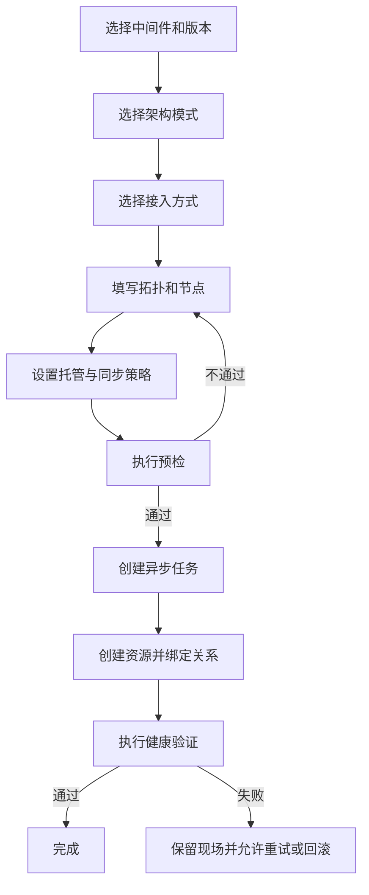
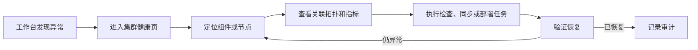
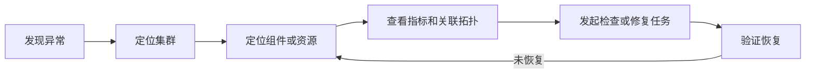
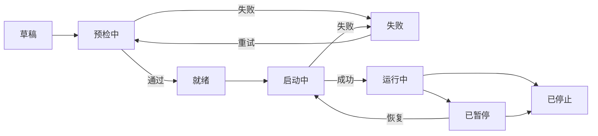
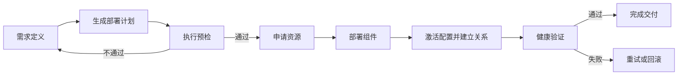

# EventMesh Dashboard 需求分析报告

| 项目 | 内容 |
| --- | --- |
| 版本 | V2.0 |
| 文档定位 | 产品需求分析与系统能力规划 |
| 产品范围 | Dashboard 前端、Dashboard 后端、EventMesh、RocketMQ、Kafka、Connector、部署、监控与消息资源管理 |
| 核心目标 | 建设一套面向 EventMesh 事件基础设施的统一管理与运维控制面 |

## 0. 核心结论

EventMesh Dashboard 不应只被定义为“中间件管理后台”，而应被定义为“事件基础设施控制面”。它统一管理 EventMesh 及其依赖的注册中心、消息中间件、Runtime、Connector 和消息资源，并为用户提供从资源接入到运行治理的完整闭环。

整个产品可归纳为四层能力：

| 能力层 | 解决的问题 | 核心对象 |
| --- | --- | --- |
| 资源模型层 | 系统中有什么，它们如何关联 | Cluster、Runtime、Topic、消费组、Connector、关系 |
| 控制策略层 | 谁主导数据，谁可以修改，如何保持一致 | 角色、ACL、托管策略、同步策略 |
| 执行任务层 | 创建、部署和变更如何可靠完成 | 创建计划、部署任务、步骤、日志、回滚 |
| 观测审计层 | 系统是否正常，发生过什么 | 健康状态、指标、告警、操作记录 |

核心闭环为：

产品设计遵循以下原则：

1. 统一对象，不强行统一中间件内部实现。
2. 页面展示业务概念，代码枚举和实现名只用于系统内部。
3. 所有写操作都必须明确目标范围、影响对象和执行结果。
4. 长时间操作统一进入异步任务，页面不等待单次请求完成。
5. Dashboard 数据与真实集群数据之间必须明确主导方，禁止不受控的双向覆盖。

## 1. 需求概述

### 1.1 产品定位

EventMesh Dashboard 面向 EventMesh 及其依赖中间件提供统一控制面，屏蔽 EventMesh、RocketMQ、Kafka 在集群组成、节点角色、复制方式和资源操作上的差异。

Dashboard 统一回答五个问题：

1. 有哪些事件基础设施资源？
2. 这些资源之间是什么关系？
3. 当前运行是否正常？
4. 用户可以执行哪些操作？
5. 操作执行到哪一步、结果如何？

### 1.2 建设目标

1. 统一展示 EventMesh、RocketMQ、Kafka 的集群、Runtime、Topic、消费组、Connector 和连接。
2. 使用“逻辑集群—组件集群—Runtime—消息资源—关系”模型表达不同中间件。
3. 支持已有集群接入、地址发现、手动创建、脚本部署和完整拓扑创建。
4. 建立健康检查、指标分析、元数据同步、部署任务和操作审计闭环。
5. 通过组织、角色、RAM 策略和 ACL，控制管理面与数据面的访问权限。

### 1.3 建设基础

| 领域 | 已具备的基础 |
| --- | --- |
| 后端 | 业务接口、认证接口和组织管理接口形成基本服务入口 |
| 前端 | 登录、工作台、集群列表与详情、Topic、消费组、连接、操作记录和成员管理具备基础页面 |
| 权限 | 具备角色、JWT 会话和组织隔离模型 |
| 资源模型 | 具备 Cluster、Runtime、集群关系以及 AP、CAP、主从等架构表达 |
| 运维能力 | 具备基础集群接入、健康数据、元数据同步和部署状态模型 |

本次 V2 在这些基础上统一产品概念、补充完整流程，并形成可分阶段交付的需求范围。

### 1.4 能力范围

| 范围 | 能力 |
| --- | --- |
| 资源管理 | 集群、Runtime、关系、Topic、消费组、ACL |
| 架构管理 | EventMesh、RocketMQ、Kafka 及其不同部署模式 |
| 接入与部署 | 手动录入、服务发现、脚本部署、复制、导入 |
| 集成管理 | Connector 模板、Connector 实例、数据连接 Pipeline |
| 运行治理 | 健康检查、指标趋势、同步状态、异常定位 |
| 安全治理 | 组织隔离、角色权限、RAM 策略、资源 ACL |
| 操作治理 | 异步任务、幂等控制、操作审计、重试和回滚 |

### 1.5 建设优先级

#### P0：基础闭环

1. 登录、组织隔离和角色权限。
2. 工作台、集群列表、集群详情、Runtime 和基础拓扑。
3. Topic、消费组和客户端连接的查询。
4. 基础集群接入、健康检查和操作记录。

#### P1：核心管理

1. RocketMQ 主从、Controller 模式和 Kafka ZooKeeper、KRaft 模式化创建。
2. 集群关系管理、部署中心、Topic 写操作和 ACL 管理。
3. Connector 目录、Connector 实例和 Connection Pipeline。
4. 系统监控、指标趋势和异步任务中心。

#### P2：高级运维

1. Kafka ZooKeeper 到 KRaft 的迁移编排。
2. 集群复制、备份恢复和元数据导入导出。
3. 消费组 Offset 重置、消息查询、测试生产消费、告警与通知。

Kafka ZooKeeper 到 KRaft 迁移的对象是集群控制元数据，不等于重置消费位点。消费位点属于具体消费组，并保存在 Kafka 内部 Topic 中；Offset 重置应作为独立、受控的消费组操作。

## 2. 角色

角色分为“组织身份”和“业务岗位”两个维度。组织身份决定权限上限，业务岗位通过 RAM 策略进一步缩小资源与操作范围。

| 角色 | 作用范围 | 主要职责 |
| --- | --- | --- |
| 组织拥有者 | 当前组织 | 最高权限、成员与管理员管理、关键操作授权 |
| 组织管理员 | 当前组织 | 集群、部署、Connector、消息资源和普通成员管理 |
| 组织成员 | 被授权资源 | 按开发、运维、测试或只读策略访问资源 |

权限分为三层：

1. Dashboard RBAC：决定能否进入页面和调用管理接口。
2. RAM 策略：决定成员能够访问哪些集群和执行哪些操作。
3. 中间件 ACL：决定用户或应用能否访问具体 Topic、消费组等消息资源。

## 3. 主要页面与核心流程

### 3.1 页面能力归纳

页面不按后端模块简单拆分，而按用户工作目标归纳为五个工作区：

| 工作区 | 页面 | 用户目标 |
| --- | --- | --- |
| 总览工作区 | 登录、工作台 | 进入系统并掌握组织整体状态 |
| 资源中心 | 集群、Runtime、Topic、消费组、客户端连接 | 查找资源、查看详情和关系 |
| 运维中心 | 系统监控、部署中心、操作审计 | 发现异常、执行变更、追踪结果 |
| 集成中心 | Connector、Connection Pipeline | 建立外部系统到事件基础设施的数据流 |
| 治理中心 | 组织成员、RAM、ACL | 管理人员权限和资源访问规则 |

### 3.2 页面信息架构

| 一级页面 | 二级页面或页签 | 主要功能 |
| --- | --- | --- |
| 登录 | 登录、会话恢复 | 登录、刷新会话、注销和异常重新认证 |
| 工作台 | 资源总览、异常摘要、最近操作 | 汇总组织资源和待处理问题 |
| 集群 | 集群列表、创建入口 | 搜索、筛选、创建和进入详情 |
| 集群详情 | 概览、拓扑、Runtime、健康、配置、安全、操作 | 集中查看和管理单个集群 |
| 拓扑中心 | 集群拓扑、影响拓扑、网络拓扑、Topic 拓扑 | 展示资源关系和影响范围 |
| 部署中心 | 任务列表、任务详情 | 查看任务步骤、日志、结果、重试和回滚 |
| Connector | 目录、实例、配置 Schema | 选择 Connector 类型并管理实例 |
| Connection | 列表、创建向导、详情 | 编排 Source—Topic—Sink 数据链路 |
| Topic | 列表、详情、创建 | 管理 Topic、Partition 或 Queue |
| 消费组 | 列表、详情、Offset | 查看消费状态、Lag 和消费位点 |
| 系统监控 | 平台监控、集群监控、链路监控、历史趋势 | 查看健康状态、异常和指标变化 |
| 操作审计 | 操作列表、操作详情 | 查询操作人、对象、结果和执行链路 |
| 组织成员 | 成员、角色、RAM 策略 | 管理成员及其资源权限 |

### 3.3 集群展示

集群页面采用“列表总览—集群详情—关系下钻—资源下钻”的展示结构。

| 展示区域 | 展示内容 | 主要操作 |
| --- | --- | --- |
| 集群列表 | 名称、类型、版本、架构模式、管理方式、健康状态、节点数 | 搜索、筛选、排序、创建 |
| 详情摘要 | 基本信息、服务地址、负责人、健康状态和关键异常 | 编辑、检查、同步 |
| 指标概览 | 可用率、吞吐量、消息堆积、异常数和资源数量 | 查看趋势、跳转异常对象 |
| 关系拓扑 | 逻辑集群、组件集群、Runtime 和依赖关系 | 展开、筛选、节点下钻 |
| 资源页签 | Runtime、Topic、消费组、连接、配置、ACL、监控、操作 | 查询和执行有权限的操作 |

拓扑归纳为四类：

| 拓扑类型 | 回答的问题 | 展示对象 |
| --- | --- | --- |
| 集群资源拓扑 | 一个 EventMesh 集群由什么组成 | EventMesh、注册或控制组件、Storage、Runtime |
| 影响关系拓扑 | 修改或删除该集群会影响谁 | 上游依赖、下游被依赖对象 |
| 网络连接拓扑 | 客户端和组件如何连接 | Client、Connector、Runtime、Broker |
| Topic 数据拓扑 | 事件从哪里来、到哪里去 | Producer、Source、Topic、消费组、Sink |

所有拓扑统一支持：

1. 按组件类型、健康状态和环境筛选。
2. 正向查看“它依赖谁”，反向查看“谁依赖它”。
3. 点击节点后展示地址、角色、版本、状态、最近心跳和关联资源。
4. 健康状态同时使用颜色、图标和文字，不能只依赖颜色。

### 3.4 核心流程

#### 登录与组织切换

关键规则：

1. 切换组织后重新加载资源范围和权限。
2. 所有资源请求都要校验组织归属。
3. 登录失效时保留当前地址，重新登录后返回原页面。

#### 集群接入与创建

关键规则：

1. 中间件版本决定可选架构模式。
2. 创建前检查名称、地址、端口、节点数、复制关系和权限。
3. 创建过程进入异步任务，允许查看步骤、日志和部分失败结果。
4. 只有资源模型、运行节点和关系均验证成功后，集群才进入可用状态。

#### 元数据操作

#### 异常处理

## 4. 集群资源管理与中间件模式

### 4.1 统一资源抽象

集群管理需要把“资源是什么”“资源如何组成”“谁负责维护”“当前处于什么状态”拆成四个独立维度。

| 维度 | 含义 | 示例 |
| --- | --- | --- |
| 资源类型 | 对象本身是什么 | EventMesh Cluster、Kafka Broker、Topic |
| 组成关系 | 对象之间如何连接 | 依赖、包含、运行于、使用 |
| 控制策略 | 谁可以修改、谁主导数据 | Dashboard 托管、外部托管、只读 |
| 运行状态 | 当前是否可用 | 正常、警告、异常、未知 |

核心实体：

| 实体 | 定义 |
| --- | --- |
| Logical Cluster | 用户认知中的完整 EventMesh、RocketMQ 或 Kafka 集群 |
| Component Cluster | 注册中心、Controller、NameServer、Broker Group 等组件集合 |
| Runtime | 实际运行进程、容器或节点实例 |
| Message Resource | Topic、Partition、Queue、消费组、ACL |
| Relationship | 资源之间的依赖、包含、连接或承载关系 |
| Operation Task | 对资源执行创建、部署、同步或变更的过程记录 |

### 4.2 平面模型

不同中间件可以进一步抽象为四个平面：

| 平面 | 职责 | 典型组件 |
| --- | --- | --- |
| 接入与集成平面 | 接收、转换和转发事件 | Client、Source Connector、Sink Connector |
| 元数据与控制平面 | 服务发现、路由、选主和元数据管理 | Nacos、Etcd、NameServer、Controller、ZooKeeper、KRaft Controller |
| 数据平面 | 实际传输或存储消息 | EventMesh Runtime、RocketMQ Broker、Kafka Broker |
| 管理平面 | 统一建模、部署、监控和审计 | EventMesh Dashboard |

这一抽象用于统一页面结构，但不把不同组件错误地等同。例如 RocketMQ NameServer 负责路由发现，Controller 负责 Broker 选主，两者不能统一显示成一个笼统的“元数据服务”节点。

### 4.3 关系模型

关系必须带有明确语义，不能只保存父子编号。

| 关系 | 含义 | 示例 |
| --- | --- | --- |
| CONTAINS | 逻辑包含 | Kafka 集群包含 Broker 集群 |
| DEPENDS_ON | 运行依赖 | EventMesh 依赖 RocketMQ |
| DISCOVERED_BY | 通过某组件发现 | Runtime 通过 Nacos 被发现 |
| CONTROLLED_BY | 由控制组件管理 | Broker Group 由 Controller 管理 |
| CONNECTS_TO | 网络或数据连接 | Client 连接 EventMesh Runtime |
| CARRIES | 承载资源 | Broker 承载 Topic Partition |

关系规则：

1. 创建关系前校验组织、类型兼容、重复关系和循环依赖。
2. 删除资源前展示正向依赖和反向影响，存在有效依赖时默认禁止删除。
3. 关系变更必须进入操作审计，生产环境保留审批扩展点。
4. 关系状态与资源状态分离：资源正常不代表连接关系正常。

### 4.4 集群接入与创建方式

| 方式 | 适用场景 | 核心输入 | 结果 |
| --- | --- | --- | --- |
| 手动录入 | 已知全部节点 | 类型、版本、节点、关系 | 建立 Dashboard 资源模型 |
| 地址发现 | 已有集群且可通过入口发现 | 注册中心、NameServer、Controller 或 Bootstrap 地址 | 发现资源并确认差异 |
| 脚本部署 | 由 Dashboard 新建集群 | 部署模板、资源、参数 | 生成部署任务 |
| Kubernetes 部署 | 云原生环境 | 集群、命名空间、CR 参数 | 生成 Operator 资源 |
| 复制创建 | 同构环境复制 | 源集群、目标环境、覆盖参数 | 复制拓扑和配置 |
| 元数据导入 | 迁移、恢复或离线交付 | 版本化导出文件 | 预览后创建资源与关系 |
| 完整拓扑创建 | 一次建立完整事件基础设施 | EventMesh、注册组件、Storage、Runtime 定义 | 编排完整依赖图 |

复制创建默认只复制资源结构和配置，不复制业务消息；如需复制消息，应定义为独立的数据迁移能力。

### 4.5 中间件模式归纳

| 组件与模式 | 控制或发现组件 | 数据节点 | Dashboard 管理重点 |
| --- | --- | --- | --- |
| EventMesh + Etcd | Etcd | EventMesh Runtime | Runtime、注册信息和存储依赖 |
| EventMesh + Nacos | Nacos | EventMesh Runtime | Runtime、服务发现和存储依赖 |
| RocketMQ 主从 | NameServer | Master/Slave Broker Group | 主从角色、复制延迟和分组操作 |
| RocketMQ Controller | NameServer + Controller | Broker 副本组 | Controller Quorum、选主和 SyncStateSet |
| Kafka ZooKeeper | ZooKeeper | Kafka Broker | 存量版本、Broker、Partition 和迁移准备 |
| Kafka KRaft | KRaft Controller Quorum | Kafka Broker | Controller、Metadata Log、Partition 和副本 |

### 4.6 EventMesh 集群模式

EventMesh 逻辑集群由 Runtime、注册或元数据组件以及存储组件共同组成。

> EventMesh Logical Cluster  
> ① Registry：Nacos 或 Etcd  
> ② Runtime：一个或多个 EventMesh Runtime  
> ③ Storage：RocketMQ、Kafka 或其他存储实现  
> ④ Connector：可选的 Source 与 Sink 实例

页面需要分别展示：

1. Runtime 对外提供的 TCP、HTTP、gRPC 和管理端口。
2. Runtime 使用的注册中心和存储集群。
3. Runtime 到存储集群的连通性和消息主链路健康。
4. Runtime、Connector 和存储组件的版本兼容关系。

### 4.7 RocketMQ 主从与 Controller 模式

#### 主从模式

管理单元是 Broker Group，而不是单个 Broker。

> RocketMQ Logical Cluster  
> ① NameServer Cluster  
> ② Broker Group A：Master + Slave  
> ③ Broker Group B：Master + Slave

关键需求：

1. Runtime 节点明确 Master 或 Slave 角色。
2. Topic、配置和 Offset 操作根据目标范围分发到多个 Broker Group。
3. 页面返回每个 Broker Group 的成功或失败结果，不能只显示一个总结果。
4. 健康检查同时关注 Master 可写、Slave 复制延迟和 NameServer 路由注册。

#### Controller 自动切换模式

Controller 负责 Broker 副本组的选主，NameServer 仍负责路由发现。Controller 可以独立部署，也可以嵌入 NameServer；生产环境需要多副本 Controller Quorum。

创建时需要配置：

1. Controller 独立或嵌入部署方式。
2. Controller 节点、端口和 Peer 列表。
3. Broker 副本组数量、每组副本数和 SyncStateSet 策略。
4. 是否允许从非同步副本中选主，并明确可能的数据丢失风险。

页面展示 Controller Leader、Term、Quorum 成员、Broker 角色和角色变更历史。详细机制参考 [RocketMQ Master-Slave Automatic Failover Mode](https://rocketmq.apache.org/docs/deploymentOperations/03autofailover/)。

### 4.8 Kafka ZooKeeper 与 KRaft 模式

#### ZooKeeper 模式

ZooKeeper 是 Kafka 存量架构中的元数据和协调组件。Topic、Partition、ACL、消费组和 Offset 操作仍应通过 Kafka API 执行，Dashboard 不直接修改 ZooKeeper 内部数据。

创建页先选择 Kafka 版本，再显示可用模式：

| Kafka 版本 | 可选模式 | 产品处理 |
| --- | --- | --- |
| 3.9.x 及以下 | 按版本支持 ZooKeeper 或 KRaft | ZooKeeper 标记为存量模式，新建优先推荐 KRaft |
| 4.0 及以上 | KRaft | 禁止选择 ZooKeeper |

#### KRaft 模式

> Kafka Logical Cluster  
> ① KRaft Controller Quorum  
> ② Kafka Broker Cluster  
> ③ Topic、Partition 与 Replica

关键需求：

1. Runtime 明确 Controller、Broker 或开发环境 Combined Role。
2. 生产环境默认使用独立 Controller 与 Broker。
3. Controller 使用奇数节点；承受 N 个同时故障需要 2N+1 个 Controller。
4. 页面展示 Controller Leader、Quorum、Metadata Log、Broker 和 Partition 健康。

Kafka 官方建议关键环境避免 Combined Mode，参考 [Kafka KRaft Documentation](https://kafka.apache.org/42/operations/kraft/)。

#### ZooKeeper 到 KRaft 迁移

迁移应作为独立运维任务，而不是普通的集群编辑。

| 阶段 | 主要动作 | 完成条件 |
| --- | --- | --- |
| 迁移准备 | 检查版本、Cluster ID、ACL 和 Broker 配置 | 满足桥接版本要求 |
| 建立 Quorum | 部署 KRaft Controller | Controller Quorum 正常 |
| 元数据迁移 | 将 ZooKeeper 元数据迁移到 KRaft | 迁移状态完成 |
| Broker 切换 | Broker 逐步切换为 KRaft 模式 | Broker 全部接入 KRaft |
| 观察期 | 验证 Topic、ACL、Partition 和客户端 | 无阻断问题 |
| 最终确认 | 退出迁移模式并下线 ZooKeeper | 明确不可回退 |

Kafka 3.9 是最后的 ZooKeeper 迁移桥接版本；Kafka 4.x 不再提供 ZooKeeper 模式。迁移的是集群控制元数据，消费组 Offset 仍由 Broker 上的内部 Topic 管理，不应在迁移流程中提供“重置 Offset”动作。参考 [Kafka 3.9 ZooKeeper to KRaft Migration](https://kafka.apache.org/39/operations/kraft/)。

### 4.9 同步与托管策略

“托管模式”不能只用一个枚举表达，应拆成五个策略维度：

| 维度 | 需要回答的问题 | 可选值 |
| --- | --- | --- |
| 资源归属 | 谁对资源生命周期负责 | Dashboard、外部平台、共同管理 |
| 发现方式 | Dashboard 如何知道资源存在 | 手动录入、注册或控制组件发现、API 查询、部署创建 |
| 首次同步来源 | 第一次以谁的数据为准 | Dashboard、真实集群 |
| 持续同步方向 | 后续数据如何变化 | 推送、拉取、仅检查、不持续同步 |
| 冲突策略 | 两侧数据不一致时如何处理 | 主导方覆盖、人工确认、拒绝变更 |

面向用户归纳为四种管理模式：

| 产品模式 | 适用场景 | 数据行为 | 页面权限 |
| --- | --- | --- | --- |
| 仅登记 | 只记录资源档案 | 不持续同步 | 查看登记信息 |
| 观察接入 | 已有生产集群 | 从集群拉取并检查差异 | 集群侧配置只读 |
| 协助管理 | 已有集群，希望在 Dashboard 执行部分操作 | 拉取为主，授权操作显式下发 | 开放指定写操作 |
| 完全托管 | Dashboard 创建并负责生命周期 | Dashboard 下发，定期检测漂移 | 开放部署和资源管理 |

创建页面不直接展示 SELF、TRUSTEESHIP_FIND、FirstToWhom 等内部值，而应询问：

1. 这个集群由谁维护？
2. 是否从入口地址自动发现节点？
3. 首次接入时以哪一侧数据为准？
4. 发现配置不一致时自动覆盖还是人工确认？
5. Dashboard 是否允许修改真实集群？

同步状态统一归纳为：

| 状态 | 含义 |
| --- | --- |
| 未配置 | 尚未选择同步策略 |
| 首次同步中 | 正在建立初始基线 |
| 一致 | 两侧数据符合策略 |
| 有漂移 | 发现差异但尚未处理 |
| 有冲突 | 两侧均发生变化，不能自动决定 |
| 同步失败 | 执行失败，可查看原因并重试 |
| 已暂停 | 暂停自动同步 |

安全规则：

1. 外部集群为主时，Dashboard 中相关配置默认只读。
2. Dashboard 为主时，下发前展示差异和影响范围。
3. 不提供无冲突策略的自动双向同步。
4. 删除同步对象前确认是“解除管理”还是“删除真实资源”。
5. 所有覆盖、忽略和冲突处理都写入审计。

## 5. 系统监控

### 5.1 监控能力抽象

系统监控分为三层：

| 层级 | 关注对象 | 回答的问题 |
| --- | --- | --- |
| 平台层 | Dashboard、数据库、任务队列、采集器 | 管理平台自身是否正常 |
| 资源层 | Cluster、Runtime、Controller、Broker | 被管理资源是否正常 |
| 数据链路层 | Client、Connector、Topic、消费组 | 事件是否能够正常流转 |

监控页面按“发现—定位—处理—验证”组织：

### 5.2 组件指标归纳

| 组件 | 核心状态 | 重点指标 |
| --- | --- | --- |
| Dashboard 服务 | 存活、就绪、版本 | Uptime、请求错误率、响应时间 |
| 数据库与任务系统 | 连接和任务状态 | 连接池、队列积压、任务失败数 |
| EventMesh Runtime | 在线、端口、存储连通性 | 请求量、发送量、消费量、延迟、错误率 |
| Nacos 或 Etcd | 节点与一致性状态 | Leader、成员数、注册数、请求延迟 |
| RocketMQ NameServer | 在线与路由状态 | Broker 注册数、路由更新时间 |
| RocketMQ Controller | Quorum 与选主状态 | Leader、Term、成员、选主次数 |
| RocketMQ Broker | 主从与存储状态 | TPS、消息堆积、复制延迟、磁盘水位 |
| Kafka Controller | Quorum 和元数据状态 | Leader、Metadata Log、选举次数 |
| Kafka Broker | 在线和副本状态 | 请求延迟、吞吐、磁盘、离线 Partition |
| Kafka Topic | Partition 和副本状态 | Under Replicated、ISR、消息速率 |
| 消费组 | 消费状态 | Lag、消费速率、活跃成员、Offset |
| Connector | 实例运行状态 | 输入量、输出量、失败量、重试和延迟 |
| 部署 Agent | 在线与任务执行状态 | 心跳、任务耗时、失败步骤 |

### 5.3 页面结构

1. 系统管理员视图：Dashboard 服务、数据库、线程池、任务和采集系统。
2. 组织运维视图：当前组织的集群健康、异常节点、同步失败和部署失败。
3. 集群健康页签：集群状态、组件状态、节点列表、历史趋势和异常事件。
4. 数据链路视图：Source、EventMesh、Topic、消费组和 Sink 的端到端状态。
5. 历史分析页签：时间范围、维度筛选、趋势对比和数据导出。

报表不再作为独立模块；历史趋势、维度对比和导出归入系统监控的“历史分析”能力。

## 6. Connector 与 Connection

### 6.1 概念抽象

| 概念 | 定义 | 是否运行 |
| --- | --- | --- |
| Connector Type | 某类外部系统的连接能力模板 | 否 |
| Connector Instance | 使用具体配置运行的 Source 或 Sink 实例 | 是 |
| Connection Pipeline | Source、事件通道和 Sink 组成的数据流任务 | 是 |
| Network Connection | Client 到 Runtime 的实际网络会话 | 是 |

Connector Connection 与 Network Connection 必须使用不同的产品名称和页面入口，避免把数据编排任务与 TCP、HTTP、gRPC 会话混为一类。

### 6.2 数据链路

Source Connector 从外部数据源获取数据并转换成事件；Sink Connector 接收事件并写入目标系统。该定义与 [Apache EventMesh Connector Design](https://eventmesh.apache.org/docs/design-document/connect/connectors/) 保持一致。

### 6.3 功能需求

#### Connector 目录

1. 按 Source、Sink、业务类型和版本筛选。
2. 展示配置 Schema，包括字段类型、必填项、默认值和说明。
3. 敏感参数加密保存，页面不回显原文。

#### Connector 实例

1. 创建实例并绑定运行环境。
2. 测试外部系统连通性。
3. 查看状态、版本、配置摘要、日志和指标。
4. 支持启动、暂停、更新和删除。

#### Connection Pipeline

1. 选择 Source 实例、事件通道和 Sink 实例。
2. 配置转换、过滤、重试和失败处理策略。
3. 预检各阶段的网络、权限和配置。
4. 展示端到端吞吐量、失败量、延迟和最近错误。

### 6.4 生命周期

Pipeline 中任一环节失败时，页面必须指出失败环节，不能只显示整个 Connection 失败。

## 7. 部署与创建

### 7.1 概念边界

创建与部署是两个不同层次：

| 概念 | 目的 | 结果 |
| --- | --- | --- |
| 资源创建 | 在 Dashboard 建立对象、配置和关系 | 得到资源模型 |
| 基础设施部署 | 在机器或 Kubernetes 中启动真实组件 | 得到运行实例 |
| 配置激活 | 将配置应用到真实组件 | 资源开始按配置运行 |
| 健康验收 | 验证节点、关系和主链路 | 资源进入可用状态 |

同一个向导可以串联这些步骤，但后端必须分别记录资源、任务和执行状态。

### 7.2 部署对象抽象

部署系统由五个对象组成：

| 对象 | 作用 |
| --- | --- |
| Deployment Plan | 描述目标组件、版本、拓扑和期望状态 |
| Deployment Task | 一次创建、更新、扩缩容或卸载任务 |
| Task Step | 任务中的可执行步骤 |
| Execution Target | 主机、容器、Kubernetes 集群或命名空间 |
| Artifact | 安装包、镜像、脚本、配置和日志 |

### 7.3 标准部署流程

| 阶段 | 主要动作 | 失败处理 |
| --- | --- | --- |
| 需求定义 | 选择组件、版本、模式和节点数 | 返回修改表单 |
| 计划生成 | 生成资源、关系和执行步骤 | 不写入真实环境 |
| 预检 | 检查权限、资源、网络、端口和版本 | 阻止提交 |
| 资源申请 | 申请主机、存储、端口或 Kubernetes 资源 | 释放已申请资源 |
| 组件部署 | 安装或启动组件 | 重试或回滚步骤 |
| 配置激活 | 下发配置并建立关系 | 恢复上一版本 |
| 健康验证 | 检查节点、Quorum、主链路和指标 | 标记部分失败 |
| 完成交付 | 更新资源状态并写入审计 | 保留完整执行记录 |

### 7.4 任务状态

前端将复杂的内部状态归纳为稳定状态：

| 用户状态 | 含义 |
| --- | --- |
| 等待中 | 等待资源、依赖或调度 |
| 执行中 | 至少一个步骤正在执行 |
| 部分成功 | 部分目标成功，部分失败 |
| 成功 | 所有必要步骤完成且健康验证通过 |
| 失败 | 任务无法继续，需要处理 |
| 已暂停 | 用户或系统暂停 |
| 回滚中 | 正在恢复到任务前状态 |
| 已取消 | 尚未完成即终止 |

内部的 Create、Update、Pause、Reset 和 Uninstall 状态作为任务步骤保留，不直接成为一级页面状态。

### 7.5 关键规则

1. 所有创建类请求使用幂等键，防止重复提交。
2. 同一集群的互斥变更不能并行执行。
3. 重试从失败步骤继续，不重复执行已成功且不可重复的步骤。
4. 回滚能力按组件声明；无法自动回滚时给出人工恢复指引。
5. 删除 Dashboard 记录与卸载真实组件必须是两个不同操作。
6. 生产环境的重置、卸载和高风险配置变更需要二次确认。
7. 提交、暂停、取消、重试和回滚全部写入操作审计。

## 8. 消息资源管理

### 8.1 领域对象

| 对象 | Kafka | RocketMQ | 统一产品概念 |
| --- | --- | --- | --- |
| 消息通道 | Topic | Topic | Topic |
| 并行单元 | Partition | Message Queue | 分区或队列 |
| 复制单元 | Partition Replica | Broker Group 内副本 | 副本 |
| 消费主体 | Consumer Group | Consumer Group | 消费组 |
| 消费位置 | Group + Topic + Partition Offset | Group + Topic + Queue Offset | 消费位点 |

统一页面展示共同字段，中间件差异字段放入“高级配置”，不能把 Kafka 的 Partition 与 RocketMQ 的 Queue 当成完全相同的实现。

### 8.2 Topic

| 功能 | 需求 |
| --- | --- |
| 列表 | 按集群、名称、状态和中间件筛选 |
| 详情 | 基本信息、分区或队列、关联消费组、配置和指标 |
| 创建 | 根据中间件显示 Partition、Queue、Replica 和保留策略 |
| 删除 | 展示影响范围、二次确认、异步执行和审计 |
| 拓扑 | 展示生产者、Topic、分区或队列、消费组和 Sink |

RocketMQ Topic 操作可能涉及多个 Broker Group，结果必须按 Broker Group 汇总；Kafka Topic 操作按 Topic 和 Partition 维度执行。

### 8.3 消费组与 Offset

Offset 表示某个消费组在某个 Topic 的 Partition 或 Queue 上已经消费到的位置。

Offset 重置必须明确四个范围：

1. 哪个集群。
2. 哪个消费组。
3. 哪个 Topic。
4. 哪些 Partition、Queue 或 Broker Group。

可选目标包括最早、最新、指定时间和指定 Offset。执行前检查活跃消费者，展示预计影响，并提示可能造成重复消费或跳过消息。Offset 重置不删除消息，也不属于 Kafka ZooKeeper 到 KRaft 迁移步骤。

### 8.4 ACL

ACL 用于规定“谁可以对什么资源执行什么操作”。

| 维度 | 示例 |
| --- | --- |
| 访问主体 | 用户、应用、AccessKey、客户端 |
| 资源 | Cluster、Topic、消费组 |
| 操作 | 查看、发送、消费、创建、修改、删除 |
| 条件 | Host、IP、资源匹配模式 |
| 结果 | 允许或拒绝 |

Dashboard 角色权限控制管理页面和接口，中间件 ACL 控制应用对消息资源的访问，两者不能互相替代。

### 8.5 消息测试

消息发送和消费主要用于联调及健康检查。生产环境默认使用专用测试 Topic，并限制消息大小、调用频率、保留时间和用户权限。

## 9. 前端页面开发排期

### 9.1 估算口径

1. 本排期只计算前端工作量，单位为前端人日。
2. 排期采用快速交付口径，基于已有前端框架、公共组件和基础页面进行增量开发。
3. 本轮只完成各页面的核心展示、必要交互、基础异常处理和接口联调。
4. 接口联调只计算前端投入，包括字段映射、权限、异常、分页、任务状态和结果验证。
5. 后端接口开发、后端问题修复、视觉设计和测试团队回归不计入本排期。
6. 接口尚未提供造成的等待时间不计入前端人日，但会影响实际交付日期。
7. 复杂拓扑动画、高级筛选、批量操作、深度体验优化和大范围公共组件重构不纳入本轮。
8. 登录页面已有基础能力，本期只做交互和异常体验优化，因此排在核心业务页面之后。

### 9.2 分页面估算

| 前端页面 | 页面开发 | 接口联调 | 页面总耗时 | 复杂度说明 |
| --- | ---: | ---: | ---: | --- |
| 工作台 | 0.5 人日 | 0.5 人日 | 1 人日 | 资源汇总和异常摘要 |
| 集群列表 | 0.5 人日 | 0.5 人日 | 1 人日 | 搜索、筛选和分页 |
| 集群详情概览 | 1 人日 | 0.5 人日 | 1.5 人日 | 资源摘要和状态联动 |
| 拓扑中心 | 1.5 人日 | 1 人日 | 2.5 人日 | 基础拓扑、筛选和节点下钻 |
| 集群创建向导 | 2.5 人日 | 1 人日 | 3.5 人日 | 版本、模式和动态表单联动 |
| Runtime、健康与配置 | 1.5 人日 | 0.5 人日 | 2 人日 | 节点、指标和配置展示 |
| Topic | 0.5 人日 | 0.5 人日 | 1 人日 | 列表、详情和基础操作 |
| 消费组与 Offset | 0.5 人日 | 0.5 人日 | 1 人日 | Lag、Offset 展示和基础操作 |
| 客户端连接 | 0.5 人日 | 0.5 人日 | 1 人日 | 会话查询和节点过滤 |
| ACL 与消息测试 | 1 人日 | 0.5 人日 | 1.5 人日 | 权限展示和基础测试入口 |
| 系统监控 | 1.5 人日 | 1 人日 | 2.5 人日 | 核心指标和基础趋势图 |
| Connector 目录与实例 | 0.5 人日 | 0.5 人日 | 1 人日 | 目录、配置和实例状态 |
| Connection Pipeline | 1.5 人日 | 0.5 人日 | 2 人日 | 基础创建流程和运行状态 |
| 部署中心 | 1.5 人日 | 1 人日 | 2.5 人日 | 任务列表、步骤和日志 |
| 操作审计 | 0.5 人日 | 0.5 人日 | 1 人日 | 多条件查询和详情 |
| 组织成员与 RAM | 0.5 人日 | 0.5 人日 | 1 人日 | 角色和资源范围 |
| 登录与组织切换 | 0.5 人日 | 0.5 人日 | 1 人日 | 登录异常、会话和组织切换优化 |
| 合计 | 16.5 人日 | 10.5 人日 | 27 人日 | 快速交付版本 |

### 9.3 单前端顺序排期

以下按照 1 名前端顺序开发，阶段周期根据页面工作量累计计算：

| 阶段 | 页面范围 | 页面工作量 | 累计工作量 |
| --- | --- | ---: | ---: |
| 第一阶段：资源入口 | 工作台、集群列表、集群详情概览、Runtime/健康/配置 | 5.5 人日 | 5.5 人日 |
| 第二阶段：集群核心 | 拓扑中心、集群创建向导、部署中心 | 8.5 人日 | 14 人日 |
| 第三阶段：消息资源 | Topic、消费组与 Offset、客户端连接、ACL 与消息测试 | 4.5 人日 | 18.5 人日 |
| 第四阶段：监控与集成 | 系统监控、Connector、Connection Pipeline | 5.5 人日 | 24 人日 |
| 第五阶段：治理与收尾 | 操作审计、组织成员与 RAM、登录与组织切换 | 3 人日 | 27 人日 |
| 排期缓冲 | 需求调整、整体回归和样式修正 | 3 人日 | 30 人日 |

页面开发与接口联调的纯工作量约为 27 个前端人日。加入整体回归缓冲后，单前端总排期建议按 30 个工作日制定，约 6 周。

如果部分页面不在本期范围，可直接从 27 人日中扣除对应页面总耗时，再按实际前端人数重新计算并行周期。
